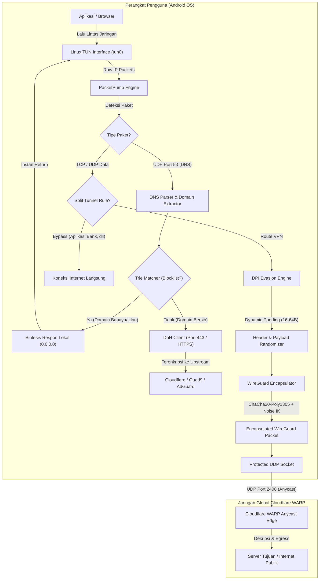
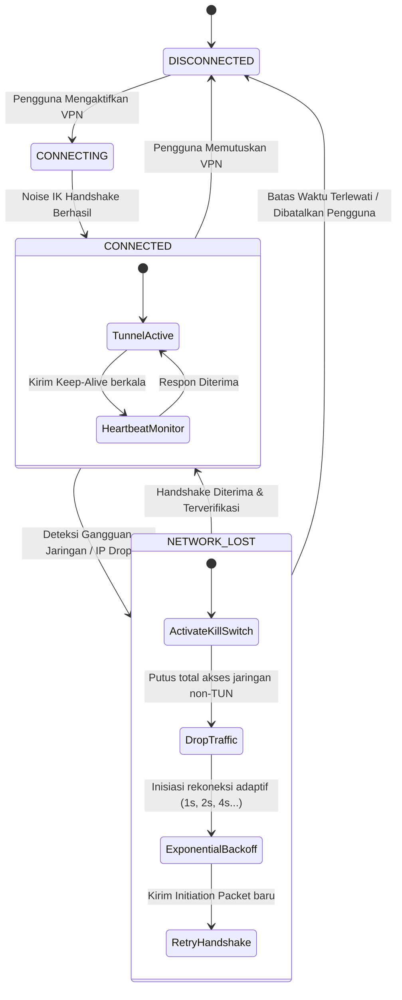

<div align="center">

# BP-VPN (Black Panther VPN)
### *High-Performance WireGuard & Cloudflare WARP Client for Android*

[-3DDC84?style=flat-square&logo=android&logoColor=white)](https://developer.android.com)
[](https://kotlinlang.org)
[](https://www.wireguard.com)
[](https://en.wikipedia.org/wiki/ChaCha20-Poly1305)
[](https://gradle.org)

<br/>

**📅 Tanggal Pembuatan Proyek:** `8 Mei 2025`  
**👨‍💻 Dibuat Oleh:** `Axel & M.B.A`  
**🔖 Rilis Resmi:** `v1.0.0 Stable`

---

</div>

## 📖 Gambaran Umum

**BP-VPN** adalah aplikasi klien VPN Android berbasis protokol modern **WireGuard** dan perutean terdesentralisasi **Cloudflare WARP Anycast**. Dirancang mengutamakan integritas jaringan, keamanan data tingkat tinggi, serta latensi rendah tanpa mengorbankan performa perangkat.

Aplikasi ini mengintegrasikan perlindungan berlapis:
* **DNS Sinkhole & DoH Resolver:** Menangkal kebocoran kueri dan pemblokiran sepihak melalui *DNS-over-HTTPS*.
* **DPI Evasion (Packet Obfuscation):** Melindungi paket dari analisis pola *Deep Packet Inspection* menggunakan *dynamic padding* dan *header morphing*.
* **Watchdog & Stateful Kill Switch:** Mencegah kebocoran IP asli saat terjadi pemutusan jaringan seketika.
* **Per-App Split Tunneling:** Pemisahan rute lalu lintas aplikasi dengan penanganan otomatis untuk aplikasi perbankan.

---

## 🏛️ Arsitektur & Alur Kerja Sistem

### 1. Packet Processing & Encryption Pipeline

Diagram berikut mengilustrasikan alur pemrosesan paket data từ saat meninggalkan aplikasi klien hingga ditransmisikan ke gateway server melalui terowongan terenkripsi:



---

### 2. State Machine: Watchdog & Kill Switch

Sistem pemantau kondisi jaringan (*Watchdog*) bekerja secara asinkron untuk menjamin tidak ada kebocoran paket saat terjadi perubahan antarmuka jaringan (misal: perpindahan Wi-Fi ke Seluler atau gangguan BTS):



---

## ⚡ Fitur Utama

| Fitur | Spesifikasi Teknis | Manfaat |
| :--- | :--- | :--- |
| **Protokol Terowongan** | WireGuard (`Noise_IKpsk2`), Anycast WARP | Kecepatan tinggi, latensi rendah, *handshake* instan. |
| **Enkripsi Data** | ChaCha20-Poly1305, Curve25519, BLAKE2s | Kriptografi generasi baru yang ringan di CPU & hemat baterai. |
| **DNS-over-HTTPS** | RFC 8484 DoH, upstream Cloudflare, AdGuard, Quad9 | Menangkal manipulasi DNS dan pencegatan ISP (*zero DNS leak*). |
| **DNS Sinkhole** | *Trie Data Structure Matcher* di memori | Pemblokiran domain iklan/malware lokal seketika tanpa latency jaringan. |
| **DPI Obfuscation** | *Dynamic Packet Padding* (16–64B), *Header Morphing* | Mengaburkan sidik jari protokol dari deteksi *Deep Packet Inspection*. |
| **Stateful Kill Switch** | Aturan filter VpnService terisolasi | Memblokir kebocoran data jika terowongan VPN terputus tiba-tiba. |
| **Split Tunneling** | Pemeriksaan paket berbasis UID aplikasi Android | Memilih aplikasi yang melewati VPN atau langsung ke jaringan lokal. |
| **Leak Auditor** | Modul pengujian mandiri (DNS, WebRTC, IPv6) | Memverifikasi secara langsung integritas koneksi dari layar aplikasi. |

---

## 📁 Struktur Direktori Kode Sumber

```
app/src/main/java/com/axel/mba/bpvpn/
├── BPApplication.kt               # Application class & dependency container
├── core/                          # Fondasi kriptografi, jaringan, & utilitas
│   ├── common/                    # Ekstensi byte, buffer, & konstanta sistem
│   ├── network/                   # DoH client, packet parser, Trie matcher
│   └── security/                  # Keystore terenkripsi & manajemen token
├── data/                          # Lapisan data lokal & integrasi remote
│   ├── local/                     # SQLite DAO, shared preferences, blocklist
│   └── remote/                    # Client API registrasi WARP & lookup IP
├── domain/                        # Model domain dan business logic use-cases
├── feature/                       # Modul fungsional independen
│   ├── dnsshield/                 # Pengaturan DoH & daftar filter domain
│   ├── obfuscation/               # Logika DPI padding & modifikasi header
│   ├── securityaudit/             # Pengujian kebocoran & kalkulasi skor
│   ├── splittunneling/            # Penanganan kebijakan rute per-aplikasi
│   └── watchdog/                  # Kill Switch & kontrol rekoneksi adaptif
├── system/                        # Android OS receivers & Quick Settings Tile
├── ui/                            # Presentasi antarmuka (Activity & Custom View)
└── vpn/                           # Engine inti VPN
    ├── dns/                       # Engine sinkhole DNS lokal
    ├── service/                   # Android VpnService lifecycle manager
    ├── tun/                       # Tunnel I/O pump & packet dispatcher
    └── tunnel/                    # WireGuard noise handshake & encapsulator
```

---

## 🛠️ Panduan Membangun (Build Instructions)

### Prasyarat Lingkungan
* **JDK:** Versi 17 (OpenJDK 17 direkomendasikan)
* **Android SDK:** API Level 26 hingga 34
* **Build Tools:** `34.0.0`

### Menjalankan Kompilasi
Gunakan skrip kompilasi otomatis yang telah dioptimalkan untuk menjaga kestabilan memori sistem (*anti-freeze single-worker pipeline*):

```bash
# Jalankan kompilasi teroptimasi
bash build_apk.sh
```

Atau lakukan build menggunakan Gradle wrapper standar:
```bash
./gradlew assembleDebug --no-daemon --max-workers=1
```

Berkas APK hasil build akan berlokasi di:
```
./BP-VPN-v1.0.apk
```

---

## 📲 Panduan Instalasi

### Melalui Android Debug Bridge (ADB):
```bash
adb install -r BP-VPN-v1.0.apk
```

### Melalui Rilis GitHub:
Berkas APK resmi yang sudah siap pakai dapat diunduh langsung pada tab **[Releases](https://github.com/DrgxByteZone/BP-VPN/releases)**.

---

## 🔒 Kebijakan Privasi & Tanpa Log (*Zero-Logs*)

1. **Tanpa Rekam Jejak Aktivitas:** Aplikasi tidak merekam situs yang dikunjungi, konten paket, atau riwayat resolusi DNS pengguna.
2. **Kriptografi Terisolasi di Sisi Klien:** Pertukaran kunci privat (*Curve25519*) dibuat secara lokal di perangkat dan tidak pernah ditransmisikan keluar.
3. **Kepatuhan Terhadap Privasi:** Seluruh filter DNS dan inspeksi kebocoran diproses secara *on-device* menggunakan memori RAM tanpa pengiriman analitik ke server pihak ketiga.

---

## 👥 Pengembang & Atribusi

Proyek ini dibangun, dikembangkan, dan dipelihara oleh:
* **Axel & M.B.A**

*Hak Cipta © 2025–2026 BP-VPN. Seluruh hak cipta dilindungi undang-undang.*
